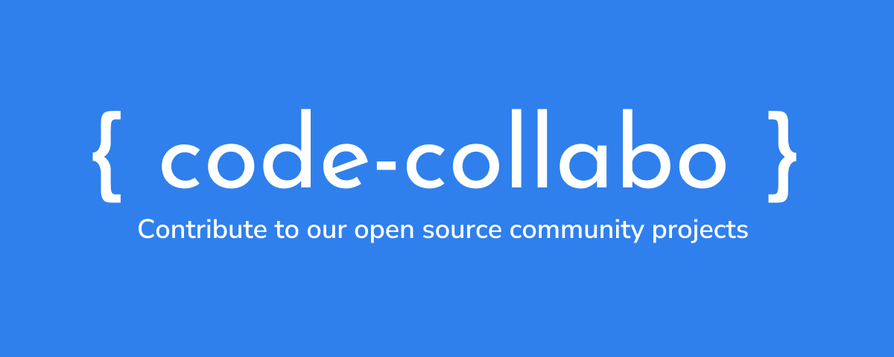

# Code Collabo

 

## Welcome to Code Collabo Community! 🙌

This is the official documentation for the [Code Collabo community project](https://github.com/code-collabo).

## How and where to start?

Start by reading these resources to know more about Code Collabo Free and Open Source community and open source:

* [Code Collabo FOSS Community](https://code-collabo.hashnode.dev/what-is-code-collabo-and-who-is-it-for)
* [What does "Free and Open Source" mean?](https://code-collabo.hashnode.dev/what-does-free-and-open-source-mean)
* Learn to use [Git and GitHub for collaboration](https://obiagba-mary.gitbook.io/git-and-github-training)


Find the link to the Code Collabo FOSS Community gitter channel, the guidelines for contributing, and projects to contribute to using the sidebar menu.



Reload any one page from this doc (whenever you come back to continue reading) so that newly added content can show up (if any new content has been added).

